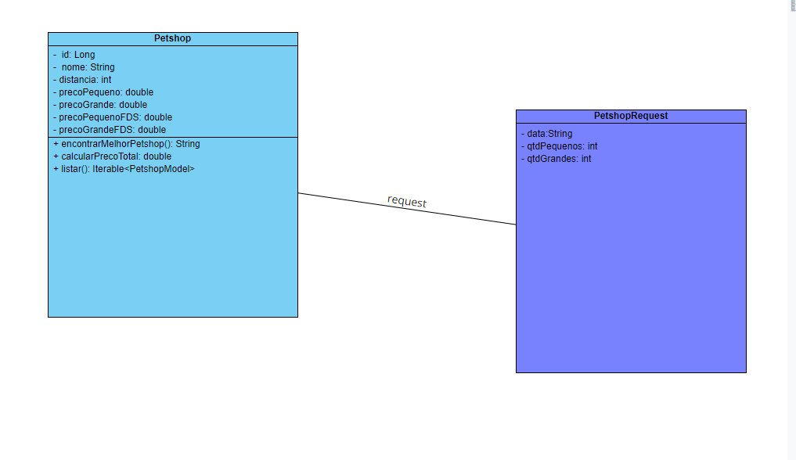

# Teste FULLSTACK - DTI Digital

`AUTOR: Pedro Henrique Barroso`

O sistema foi projetado com uma interface intuitiva e de fácil utilização, visando proporcionar uma experiência amigável ao usuário final. Ele consiste em uma página web especialmente desenvolvida para o canil "Cães do Lar". 
A página apresenta um formulário simples, composto por campos para inserção de informações, incluindo a data desejada, a quantidade de cães pequenos, a quantidade de cães grandes e um botão para enviar essas informações para o processamento no backend.

O objetivo principal do sistema é permitir que o usuário forneça esses dados de maneira rápida e eficiente, para que o sistema possa realizar uma verificação automática e apresentar a opção de petshop com o melhor custo-benefício.

## Linguagens Utilizadas:

* HTML
* CSS
* JAVASCRIPT / REACT
* JAVA / SPRING BOOT

## Decisões de projeto:

A escolha do Spring Framework, especialmente o Spring Boot, para o desenvolvimento do backend tem várias vantagens que se alinham com os requisitos e demandas do projeto:

* Facilidade de Configuração: O Spring Boot oferece uma configuração mínima, reduzindo a sobrecarga de configuração manual, o que acelera o desenvolvimento e facilita a manutenção.

* Produtividade: Com o Spring Boot, é possível criar rapidamente aplicativos robustos com uma arquitetura modular, usando anotações e convenções que simplificam o desenvolvimento.

* Suporte a APIs RESTful: O Spring possui um excelente suporte para o desenvolvimento de APIs RESTful, com recursos como o Spring Web MVC e o Spring Data, que simplificam a criação e o consumo de APIs REST.

* Ecossistema Abundante: O Spring Framework possui um vasto ecossistema de bibliotecas e ferramentas que podem ser facilmente integradas aos projetos, oferecendo uma ampla gama de funcionalidades e recursos prontos para uso.

Esses são apenas alguns dos motivos pelos quais escolhi o Spring Framework para o desenvolvimento do backend. Sua robustez, flexibilidade e facilidade de uso o tornaram uma escolha sólida, além de ser o framework que estou estudando no momento. 
O Front-end em React foi recomendado pela DtiDigital, então decidi seguir a recomendação.

## Lista de premissas assumidas 
* Requisitos do Cliente: Pressupõe-se que os requisitos fornecidos pelo cliente estão corretos.

* Disponibilidade de Recursos: Supõe-se que os recursos necessários, como hardware e software estejam disponíveis.

* Integração com Sistemas Externos: Assume-se que a integração com sistemas externos, APIs e banco de dados PostgreSQL, ocorrerá de acordo com as especificações fornecidas e sem interrupções significativas.

* Testes e Qualidade do Software: Assume-se que serão realizados testes adequados para garantir a qualidade do software e que os defeitos identificados serão corrigidos antes da implantação.

## Diagrama de classe

Explicação: 

O Front-end envia uma requisição do tipo Post para a API com os campos (data, qtdPequenos e qtdGrandes). A partir disso, a API realiza os calculos de preço total, levando em consideração a distância, o dia da semana(data), a quantidade de cães e encontra o melhor Petshop possível.
